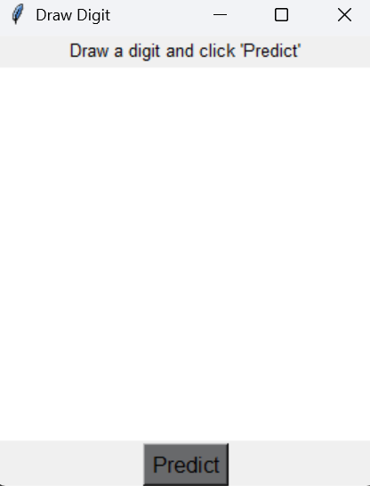
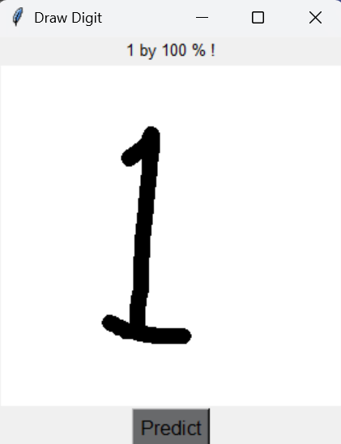
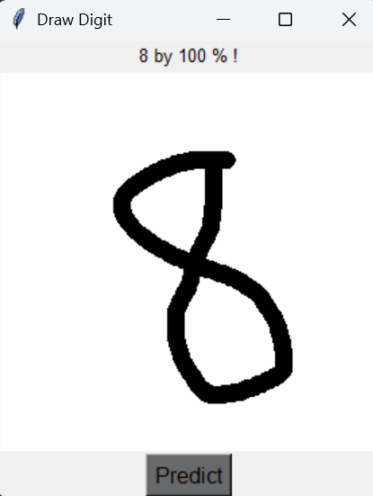
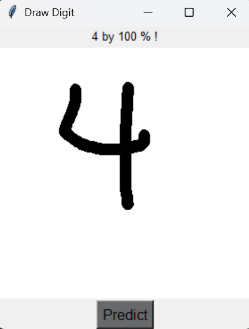
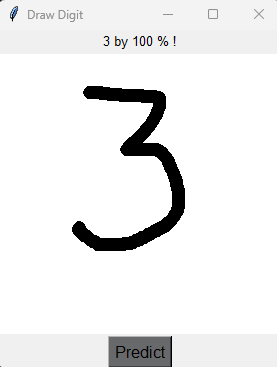

# 🖋️ Handwritten Digit Recognition

Welcome to the **Handwritten Digit Recognition** project! This project uses the power of machine learning to accurately recognize handwritten digits from images, making use of the **MNIST dataset**. 

## 🔧 Features

- 🌐 **Convolutional Neural Networks (CNNs)** for high accuracy
- 🔍 **MNIST Dataset** integration
- 📊 **Real-time prediction**
- 🎨 **Interactive digit drawing and prediction** with a Tkinter GUI

## 📒 Table of Contents

- [🖋️ Handwritten Digit Recognition](#️-handwritten-digit-recognition)
  - [🔧 Features](#-features)
  - [📒 Table of Contents](#-table-of-contents)
  - [🚀 Installation](#-installation)
  - [🔢 Usage](#-usage)
  - [🎨 Drawing and Predicting Digits](#-drawing-and-predicting-digits)
  - [📚 Dataset](#-dataset)
  - [🚒 Contributing](#-contributing)
  - [💎 License](#-license)
    - [🎉 Happy Coding! 🎉](#-happy-coding-)

## 🚀 Installation

Follow these steps to get started:

1. Clone the repository:
   ```bash
   git clone https://github.com/HosseinTahami/Handwritten-Digit-Recognition.git
   ```
2. Navigate to the project directory:
   ```bash
   cd Handwritten-Digit-Recognition
   ```
3. Install the required dependencies:
   ```bash
   pip install -r requirements.txt
   ```

## 🔢 Usage

1. **Run the Tkinter GUI for drawing and prediction:**
   ```bash
   python window.py
   ```
   - Windows before prediction

       <div>
       <br>
          
      
       <div>
      <br>
   - Windows after prediction
      <div>
         <br>
         
         
         
         
      <div>
      <br>

## 🎨 Drawing and Predicting Digits

You can interactively draw digits and predict them using the Tkinter GUI:

1. Run the `window.py` script to open the Tkinter window:
   ```bash
   python window.py
   ```

2. Draw a digit in the window using your mouse.
3. Click the **Predict** button to see the predicted digit along with the confidence percentage.

## 📚 Dataset

The project uses the popular **MNIST** dataset, which contains 60,000 training images and 10,000 testing images of handwritten digits (0-9).

## 🚒 Contributing

We welcome contributions from the community! 😊 To contribute:

1. Fork the repository
2. Create a new branch
3. Make your changes
4. Submit a pull request

## 💎 License

This project is licensed under the MIT License. See the [LICENSE](LICENSE) file for details.

---

Enjoy coding! 💻✨ Feel free to open an issue if you have any questions or suggestions.

### 🎉 Happy Coding! 🎉
